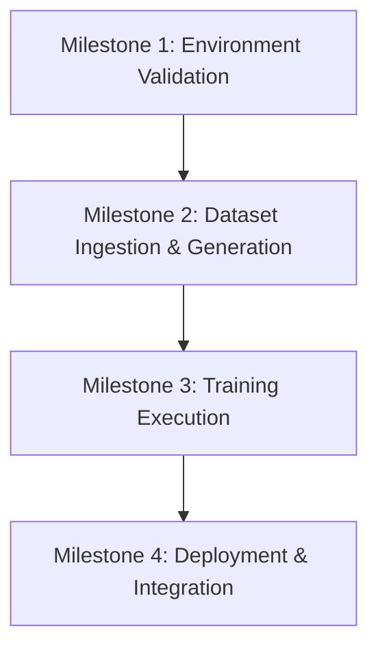

# Roadmap: Model Fine-Tuning Pipeline

## 🗺️ Milestones Overview

---

## 📍 Milestones & Slices

### Milestone 1: Environment & Hardware Setup Validation
Verify the local environment has the capability to run the fine-tuning code.
*   **Slice 1.1: local GPU capability check**
    *   Confirm PyTorch has CUDA access.
    *   Check available VRAM (8GB+ required, 12GB+ recommended).
*   **Slice 1.2: Unsloth installation and virtual environment setup**
    *   Establish a python virtual environment dedicated to fine-tuning.
    *   Install PyTorch, `xformers`, and `unsloth` following local guidelines for Windows.
*   **Slice 1.3: Cloud Fallback Setup**
    *   Establish a Google Colab notebook script template that can consume the exported dataset zip in case local resources are insufficient.

### Milestone 2: Dataset Preparation
Compile the inputs from both sources.
*   **Slice 2.1: Kannada dictionary dataset compilation**
    *   Verify the existence and size of `data/training/kannada_dictionary_sft.json`.
    *   Ensure database seeding is complete by checking the `multisyllabic_words` table.
*   **Slice 2.2: Style and preference dataset generation**
    *   Trigger `/api/training/generate` to construct `dataset.json` and `dpo_dataset.json` from sqlite database history.
    *   Preview the datasets to verify formatting and alignment.
*   **Slice 2.3: Dataset mixing design**
    *   Plan the dataset blending strategy (e.g., mixing Kannada definitions and rap verses at a balanced ratio, or training in two steps).

### Milestone 3: Fine-Tuning Execution
Run the model training pipeline.
*   **Slice 3.1: Phase 1 SFT (Vocabulary Injection)**
    *   Train base model on `kannada_dictionary_sft.json` to inject Kanglish translations.
*   **Slice 3.2: Phase 2 SFT + DPO (Style Adaptation & Preference Alignment)**
    *   Load vocabulary-tuned model (or checkpoint).
    *   Train on the user's style SFT data and align it using DPO pairs from rejected lines/arena votes.
*   **Slice 3.3: (Alternative) Joint training**
    *   Run a single training session on a mixed corpus to save training time and prevent catastrophic forgetting.

### Milestone 4: Deployment & Integration
Merge, convert, and load the final model.
*   **Slice 4.1: Model Merging and GGUF Conversion**
    *   Merge LoRA weights into 16-bit base model.
    *   Use llama.cpp (built-in via Unsloth) to export the model to `Q4_K_M` GGUF.
*   **Slice 4.2: LM Studio deployment**
    *   Move the `.gguf` file to LM Studio's local models folder.
    *   Load the model in LM Studio.
*   **Slice 4.3: Configuration and Verification**
    *   Set VibeLyrics configuration provider to `lmstudio` with local base URL.
    *   Verify lyric completions, rhyme suggestions, and style alignment by writing a test verse.
