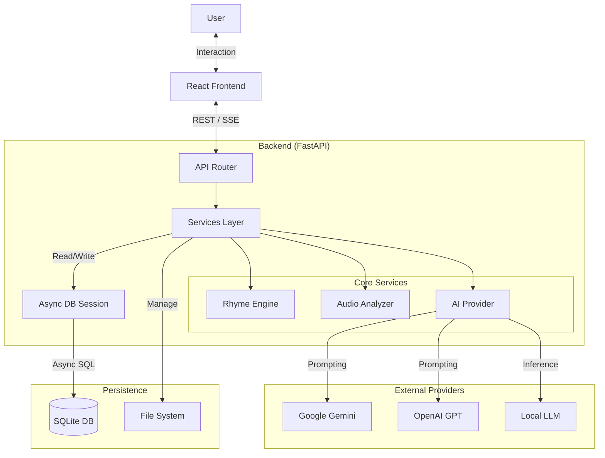

# VibeLyrics 🎤

**VibeLyrics** is a professional-grade hip-hop lyric writing assistant and analysis suite. It combines a distraction-free writing environment with advanced algorithmic analysis, AI styling, and full production tools to help artists craft complex rhymes and flows.

---

## 🌟 Key Features

### 📖 Smart Writing Interface

- **Left-Side Split Panels**: New intuitive layout with floating toggles for **RhymeWave** (rhyme dictionary) and **AI Help**.
- **Real-Time AI Streaming**: Ghost text streams in instantly as you type (like ChatGPT).
- **Power Tools**: Undo/Redo history (`Ctrl+Z`), Keyboard Shortcuts, and Lazy Loading.
- **Offline Support**: Full functionality offline via Service Workers.
- **Smart Dictionary**: Right-click *any* word for 6-layer analysis (Rhymes, Synonyms, Slang).
- **Multi-Language Rhymes**: Native support for **English, Hindi, and Kannada** phonetic rhymes.
- **Stress Pattern Detection**: Automatic analysis of rhythm and meter (e.g., `/x/x` for trochaic).
- **Export Options**: Export to PDF (styled), TXT, or JSON backup.

### 🎨 Modern "Dreamy" Design System

- **Glassmorphism UI**: Premium frosted-glass cards, ethereal deep-space backgrounds, and aurora gradients.
- **Micro-Interactions**: Satisfying ripple effects, smooth hover lifts, and glowing focus states.
- **Fluid Animations**:
  - **Page Transitions**: Smooth fade-and-slide navigation via Framer Motion.
  - **Skeleton Loading**: Polished shimmer effects during data fetching.
  - **Staggered Lists**: Cinematic entrance animations for content.
- **Performance Optimized**: Lazy loading, code splitting, and memoized components for 60fps interaction.

## ✨ Key Features

- **👻 AI Ghostwriter ("Vibe")**: An advanced AI partner that mimics your unique style, vocabulary, and emotional tone. It learns from your **Journal** and respects your **Banned/Favorite Words**.
- **📓 Private Journal**: Capture loose thoughts and daily emotions. The AI reads this context to provide suggestions that match your current headspace.
- **🎤 Advanced Rhyme Engine**:
  - **Multi-Color Highlights**: Visualizes assonance, consonance, and internal rhymes in real-time.
  - **Scheme Detection**: Automatically identifies patterns like **ABAB**, **AABB**, and **XAXA** as you write.
- **🎛️ Deep Customization**: Set your **Favorite Words**, **Banned Words**, and **Slang Preferences** to tailor the AI's vocabulary.
- **📚 Learning Center**: Interactive modules on Song Structure, Storytelling, and Performance.
- **⚡ Real-time Analysis**: Instant feedback on syllable counts, stress patterns, and figures of speech.

### 🧠 Robust AI Engine

- **Model Rotation**: Automatic fallback hierarchy (Gemini 2.5 → 2.0 → Flash Lite → Gemma).
- **Quota Management**: Intelligently handles rate limits without disrupting your flow.
- **Real-Time Streaming**: Instant ghost-text suggestions that adapt to your typing speed.
- **Brainstorming**: Generate creative themes and catchy song titles on demand.
- **Adlib Suggestion**: Context-aware adlib placement ideas (Hype, Flow, Reaction).

### 🎨 AI Style Transfer

Write in the signature style of legendary artists:

- **Available Styles**: Eminem, Kendrick Lamar, Drake, J. Cole, Nas, Travis Scott, Jay-Z, Kanye West.
- **Style Characteristics**: Mimics rhyme patterns, vocabulary density, and flow structures.
- **Transformation**: Rewrite your lines to match a specific artist's voice.

### 📊 Stats & Gamification

- **Writing Dashboard**: Track lines written, vocabulary growth, and daily consistency.
- **Rhyme Scheme Analysis**: See which schemes you use most (AABB, ABAB, Compound).
- **Achievements**: Unlock badges for streaks, complex multi-syllabics, and flow mastery.

### 🔍 Search & Recall

- **Full-Text Search**: Instantly find any line you've ever written, even with typos (fuzzy matching).
- **Phonetic Search**: Find lines from your history that *sound* like your current idea.
- **Reference Management**: organize and search your reference tracks and lyrics.

### ⚡ Background Processing

- **Async AI Generation**: Get suggestions without freezing your interface.
- **Audio Analysis**: Background BPM detection and waveform generation.
- **Task Queue**: Robust job processing tasks.

---

## 📐 Architecture



---

## 🛠️ Technology Stack

### 💻 Frontend (Modern Vibe)

- **Core**: React 19 + TypeScript + Vite 7
- **Styling**: Tailwind CSS 4 + clsx + tailwind-merge
- **State Management**: Zustand 5 (Atomic state)
- **Animations**: Framer Motion 12 (Page transitions, Micro-interactions)
- **Routing**: React Router v7
- **Audio Visualization**: Wavesurfer.js 7
- **Notifications**: React Hot Toast

### 🔌 Backend (Async Power)

- **Framework**: FastAPI (Python 3.11+)
- **Database**: SQLAlchemy 2.0 (Async) + AIOSQLite
- **Real-time**: WebSocket / SSE (Server-Sent Events)
- **Validation**: Pydantic v2
- **Audio Analysis**: Librosa + NumPy

### 🧠 AI & NLP Engine

- **LLM Providers**:
  - Google Gemini 2.0 (Primary)
  - OpenAI GPT-4o (Fallback)
  - Local LLM (future support)
- **Rhyme Engine**: CMU Dict (`pronouncing`) + Phonetic Algorithms
- **Concept Extraction**: Custom NLP pipeline using NLTK/Spacy (lightweight)

### 🏗️ DevOps & Tools

- **Containerization**: Docker + Docker Compose
- **Linting**: ESLint + Prettier
- **Package Managers**: npm + pip

---

## 📂 Project Structure

```text
vibelyrics/
├── backend/                # FastAPI Application
│   ├── main.py             # App Entry Point & Middleware
│   ├── config.py           # Configuration & Settings
│   ├── database.py         # Async Database Connection
│   ├── models/             # SQLAlchemy Database Models
│   ├── routers/            # API Route Handlers (Sessions, Lines, AI, Journal)
│   ├── schemas/            # Pydantic Data Schemas
│   └── services/           # Core Business Logic
│       ├── ai_provider.py      # LLM Integration (Gemini/OpenAI)
│       ├── rhyme_detector.py   # Phonetic Rhyme Engine
│       ├── audio.py            # Audio Analysis (BPM)
│       └── advanced_analysis.py # Concept Extraction
├── frontend/               # React Frontend (Vite)
│   ├── src/
│   │   ├── components/     # UI Components
│   │   │   ├── ui/             # Core Atoms (Button, Card, Skeleton)
│   │   │   ├── layout/         # Layout (Navbar, Layout)
│   │   │   └── session/        # Feature Components
│   │   ├── hooks/          # Custom Hooks (useAutoSave, useKeyboardShortcuts)
│   │   ├── pages/          # Application Pages
│   │   ├── services/       # API Client & Types
│   │   ├── store/          # Zustand State Management
│   │   ├── styles/         # Global Styles & Variables (Dreamy Theme)
│   │   └── types/          # TypeScript Definitions
│   └── vite.config.ts      # Vite Configuration
├── data/                   # Local Persistence
│   └── vibelyrics.db       # SQLite Database
├── docker-compose.yml      # Container Orchestration
├── Dockerfile              # Docker Build Instructions
├── run.py                  # Unified Development Runner
└── requirements.txt        # Python Dependencies
```

---

## 🚀 Getting Started

### Prerequisites

- **Python 3.10+** (Recommend 3.11)
- **Node.js 18+**
- **Git**

### 1. Setup

Clone the repository and enter the directory:

```bash
git clone https://github.com/yourusername/vibelyrics.git
cd vibelyrics
```

Create a virtual environment and install backend dependencies:

```bash
# Windows
python -m venv .venv
.venv\Scripts\activate

# Mac/Linux
python3 -m venv .venv
source .venv/bin/activate

# Install dependencies
pip install -r requirements.txt
```

Install frontend dependencies:

```bash
cd frontend
npm install
cd ..
```

### 23. **Configure API Keys**

   Copy the example environment file:

   ```bash
   cp .env.example .env      # Mac/Linux
   # OR
   copy .env.example .env    # Windows
   ```

   Then open `.env` and add your keys:

   ```env
   GEMINI_API_KEY=your_key_here
   OPENAI_API_KEY=your_key_here    # Optional
   ```

### 3. Running the Application

#### Option A: Unified Runner (Recommended for simple dev)

The `run.py` script starts both the FastAPI backend and the React frontend in a single terminal.

```bash
python run.py
```

- **Frontend**: <http://localhost:5173>
- **Backend**: <http://localhost:5000>

#### Option B: Manual Mode (Split Terminals)

##### Terminal 1: Backend

```bash
python -m uvicorn backend.main:app --reload --port 8003
```

*Note: The app may default to port 8003 or 5000 depending on config. Check console output.*

##### Terminal 2: Frontend

```bash
cd frontend
npm run dev
```

#### Option C: Docker (Production-ready)

Build and run the entire stack with Docker Compose:

```bash
docker-compose up --build
```

---

## 🔍 API Documentation

Interactive Swagger documentation is auto-generated and available when the backend is running.

- **Swagger UI**: `http://localhost:5000/docs` (or port 8003)
- **ReDoc**: `http://localhost:5000/redoc`

### Core Endpoints

- `GET /api/sessions`: List all sessions
- `POST /api/lines`: Add a new lyric line
- `POST /api/ai/suggest`: Get AI suggestions (Streaming)
- `POST /api/journal`: Create a journal entry
- `POST /api/settings`: Update user preferences

---

## 🤝 Contributing

Contributions are welcome! Please run tests before submitting PRs:

```bash
pytest
```

## 📄 License

Distributed under the MIT License.
