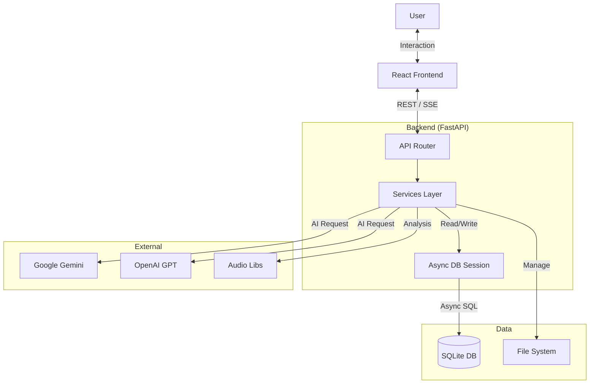

# VibeLyrics 🎤

**VibeLyrics** is a professional-grade hip-hop lyric writing assistant and analysis suite. It combines a distraction-free writing environment with advanced algorithmic analysis, AI styling, and full production tools to help artists craft complex rhymes and flows.

---

## 🌟 Key Features

### 📖 Smart Writing Interface

- **Left-Side Split Panels**: New intuitive layout with floating toggles for **RhymeWave** (rhyme dictionary) and **AI Help**.
- **Real-Time AI Streaming**: Ghost text streams in instantly as you type (like ChatGPT).
- **Power Tools**: Undo/Redo history (`Ctrl+Z`), Keyboard Shortcuts, and Lazy Loading.
- **Offline Support**: Full functionality offline via Service Workers.
- **Smart Dictionary**: Right-click *any* word for 6-layer analysis (Rhymes, Synonyms, Slang).
- **Multi-Language Rhymes**: Native support for **English, Hindi, and Kannada** phonetic rhymes.
- **Stress Pattern Detection**: Automatic analysis of rhythm and meter (e.g., `/x/x` for trochaic).
- **Export Options**: Export to PDF (styled), TXT, or JSON backup.

### 🎨 Modern Design System

- **React SPA**: Built with React 18, TypeScript, and Vite for blazing fast performance.
- **Tailwind CSS**: Professional styling with a custom "Vibe" aesthetic.
- **Glassmorphism**: Premium frosted-glass UI elements for improved depth and visual hierarchy.
- **Micro-Interactions**: Smooth hover effects, transitions, and glow animations.
- **Responsive Layouts**: Properly optimized for all screen sizes with split-view capabilities.

### 🧠 Robust AI Engine

- **Model Rotation**: Automatic fallback hierarchy (Gemini 2.5 → 2.0 → Flash Lite → Gemma).
- **Quota Management**: Intelligently handles rate limits without disrupting your flow.
- **Real-Time Streaming**: Instant ghost-text suggestions that adapt to your typing speed.
- **Brainstorming**: Generate creative themes and catchy song titles on demand.
- **Adlib Suggestion**: Context-aware adlib placement ideas (Hype, Flow, Reaction).

### 🎨 AI Style Transfer

Write in the signature style of legendary artists:

- **Available Styles**: Eminem, Kendrick Lamar, Drake, J. Cole, Nas, Travis Scott, Jay-Z, Kanye West.
- **Style Characteristics**: Mimics rhyme patterns, vocabulary density, and flow structures.
- **Transformation**: Rewrite your lines to match a specific artist's voice.

### 📊 Stats & Gamification

- **Writing Dashboard**: Track lines written, vocabulary growth, and daily consistency.
- **Rhyme Scheme Analysis**: See which schemes you use most (AABB, ABAB, Compound).
- **Achievements**: Unlock badges for streaks, complex multi-syllabics, and flow mastery.

### 🔍 Search & Recall

- **Full-Text Search**: Instantly find any line you've ever written, even with typos (fuzzy matching).
- **Phonetic Search**: Find lines from your history that *sound* like your current idea.
- **Reference Management**: organize and search your reference tracks and lyrics.

### ⚡ Background Processing

- **Async AI Generation**: Get suggestions without freezing your interface.
- **Audio Analysis**: Background BPM detection and waveform generation.
- **Task Queue**: Robust job processing tasks.

---

## 📐 Architecture



---

## 🛠️ Technology Stack

- **Backend**: Python 3.11+ with **FastAPI** (Async)
- **Frontend**: **React 18** + TypeScript + Vite + Tailwind CSS
- **Database**: SQLite + **SQLAlchemy (Async)**
- **Real-time**: Native FastAPI StreamingResponse (SSE)
- **AI**: Google Gemini / OpenAI integration
- **Audio**: Librosa & Wavesurfer.js
- **Testing**: Pytest (Async)

---

## 📂 Project Structure

```text
vibelyrics/
├── backend/                # FastAPI Application
│   ├── main.py             # App Entry Point
│   ├── config.py           # Settings
│   ├── database.py         # Async DB Setup
│   ├── models/             # SQLAlchemy Models
│   ├── routers/            # API Endpoints (Sessions, Lines, AI, etc.)
│   ├── services/           # Business Logic
│   │   ├── ai_provider.py      # Gemini/OpenAI Logic
│   │   ├── rhyme_detector.py   # Multi-language Rhyme Engine
│   │   ├── audio.py            # BPM & Waveform Analysis
│   │   ├── learning.py         # Style Learning System
│   │   └── references.py       # Reference Manager
│   └── schemas/            # Pydantic Models
├── frontend/               # React Application
│   ├── src/
│   │   ├── components/     # UI Components
│   │   ├── pages/          # Route Pages
│   │   ├── services/       # API Client
│   │   └── styles/         # CSS Modules
│   └── vite.config.ts
├── tests/                  # Pytest Suite
├── data/                   # Local Data Storage
├── run.py                  # Unified Runner Script
└── requirements.txt
```

---

## 🚀 Getting Started

### Prerequisites

- Python 3.10+
- Node.js 18+

### Quick Start

1. **Clone the repository**:

   ```bash
   git clone https://github.com/yourusername/vibelyrics.git
   cd vibelyrics
   ```

2. **Setup Environment**:

   ```bash
   # Create virtual environment
   python -m venv .venv
   source .venv/bin/activate  # Windows: .venv\Scripts\activate

   # Install Python dependencies
   pip install -r requirements.txt

   # Install Frontend dependencies
   cd frontend
   npm install
   cd ..
   ```

3. **Configure API Keys**:
   Create a `.env` file in the root directory:

   ```env
   GEMINI_API_KEY=your_key_here
   OPENAI_API_KEY=your_key_here
   ```

4. **Run Application**:
   Use the unified runner to start both backend and frontend:

   ```bash
   python run.py
   ```

   - Frontend: `http://localhost:5173`
   - Backend API: `http://localhost:5000`
   - API Docs: `http://localhost:5000/docs`

---

## 🔍 API Documentation

Interactive Swagger documentation is available at `/docs` when running the backend.

### Core Endpoints

- `GET /api/sessions`: List all sessions
- `POST /api/lines`: Add a new lyric line
- `POST /api/ai/suggest`: Get AI suggestions
- `POST /api/rhymes/search`: Find rhymes
- `GET /api/audio/analyze/{filename}`: Analyze audio file

---

## 🤝 Contributing

Contributions are welcome! Please run tests before submitting PRs:

```bash
pytest
```

## 📄 License

Distributed under the MIT License.
