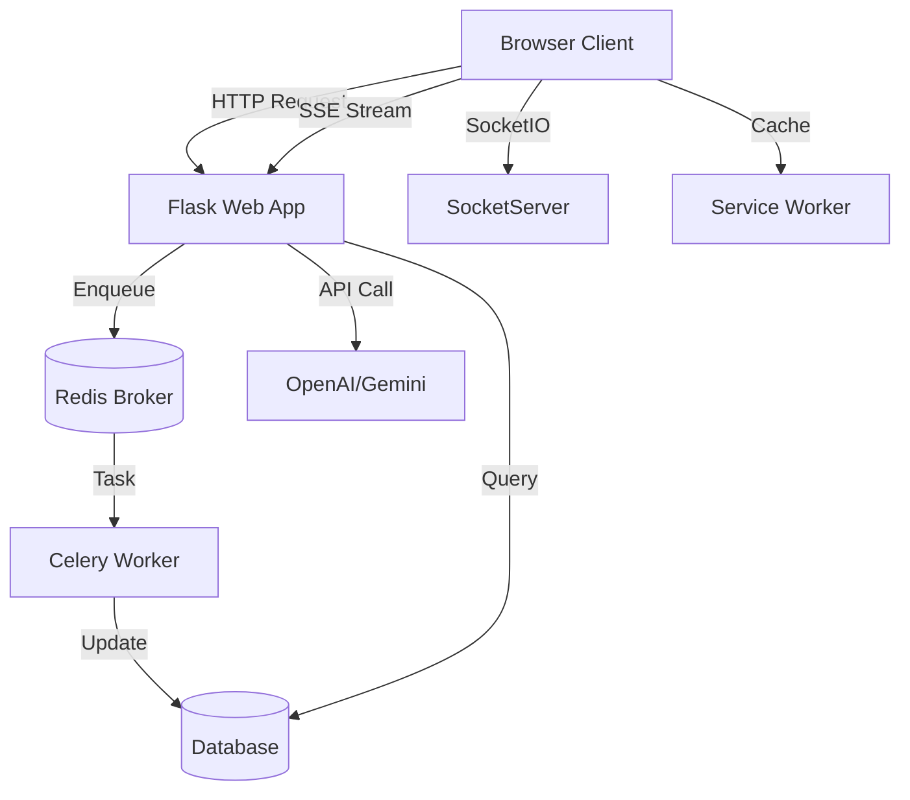

# VibeLyrics 🎤

**VibeLyrics** is a professional-grade hip-hop lyric writing assistant and analysis suite. It combines a distraction-free writing environment with advanced algorithmic analysis, AI styling, and full production tools to help artists craft complex rhymes and flows.

---

## 🌟 Key Features

### 📖 Smart Writing Interface

- **Left-Side Split Panels**: New intuitive layout with floating toggles for **RhymeWave** (rhyme dictionary) and **AI Help**.
- **Real-Time AI Streaming**: Ghost text streams in instantly as you type (like ChatGPT).
- **Power Tools**: Undo/Redo history (`Ctrl+Z`), Keyboard Shortcuts, and Lazy Loading.
- **Offline Support**: Full functionality offline via Service Workers.
- **Smart Dictionary**: Right-click *any* word for 6-layer analysis (Rhymes, Synonyms, Slang).
- **Export Options**: Export to PDF (styled), TXT, or JSON backup.

### 🎨 Modern Design System

- **Tailwind CSS**: Professional styling with a custom "Vibe" aesthetic.
- **Glassmorphism**: Premium frosted-glass UI elements for improved depth and visual hierarchy.
- **Micro-Interactions**: Smooth hover effects, transitions, and glow animations.
- **Responsive Layouts**: Properly optimized for all screen sizes with split-view capabilities.

### 🧠 Robust AI Engine

- **Model Rotation**: Automatic fallback hierarchy (Gemini 2.5 → 2.0 → Flash Lite → Gemma).
- **Quota Management**: Intelligently handles rate limits without disrupting your flow.
- **Real-Time Streaming**: Instant ghost-text suggestions that adapt to your typing speed.

### 🎨 AI Style Transfer

Write in the signature style of legendary artists:

- **Available Styles**: Eminem, Kendrick Lamar, Drake, J. Cole, Nas, Travis Scott, Jay-Z, Kanye West.
- **Style Characteristics**: Mimics rhyme patterns, vocabulary density, and flow structures.
- **Transformation**: Rewrite your lines to match a specific artist's voice.

### 📊 Stats & Gamification

- **Writing Dashboard**: Track lines written, vocabulary growth, and daily consistency.
- **Rhyme Scheme Analysis**: See which schemes you use most (AABB, ABAB, Compound).
- **Achievements**: Unlock badges for streaks, complex multi-syllabics, and flow mastery.

### 🔍 Search & Recall

- **Full-Text Search**: Instantly find any line you've ever written, even with typos (fuzzy matching).
- **Phonetic Search**: Find lines from your history that *sound* like your current idea.
- **Callback Detection**: Automatic alerts when you reference your past work (perfect for callbacks).

### ⚡ Background Processing

- **Async AI Generation**: Get suggestions without freezing your interface.
- **Audio Analysis**: Background BPM detection and waveform generation.
- **Task Queue**: Robust job processing powered by Celery & Redis.

---

## 🛠️ Technology Stack

- **Backend**: Python 3.10+ with Flask
- **Frontend**: Alpine.js + Tailwind CSS + Custom Design System
- **Real-time**: Server-Sent Events (SSE) & Flask-SocketIO
- **Search Engine**: **Whoosh** (Pure Python Full-Text Search)
- **Task Queue**: **Celery** + **Redis** (Async processing)
- **AI**: OpenAI GPT-4, Google Gemini, lmstudio
- **Audio**: Librosa & Wavesurfer.js

---

## 📂 Project Structure

```text
vibelyrics/
├── app/
│   ├── ai/                 # AI Logic
│   │   ├── openai_provider.py
│   │   ├── gemini_provider.py
│   │   ├── lmstudio_provider.py
│   │   ├── context_builder.py
│   │   ├── prompts.py
│   │   └── style_library.py
│   ├── analysis/           # Algorithmic Analysis
│   │   ├── rhyme_detector.py
│   │   ├── syllable_counter.py
│   │   ├── complexity_scorer.py
│   │   ├── metaphor_engine.py
│   │   └── ...
│   ├── learning/           # Personalization
│   │   ├── style_extractor.py
│   │   ├── correction_tracker.py
│   │   └── vector_store.py
│   ├── models/             # Database Models
│   │   ├── lyrics.py
│   │   ├── user_profile.py
│   │   └── journal.py
│   ├── routes/             # API Blueprints
│   │   ├── api.py          # REST API
│   │   ├── streaming.py    # SSE Streaming
│   │   ├── workspace.py    # UI Routes
│   │   └── stats.py
│   ├── search/             # Whoosh Search Engine
│   │   └── search_index.py
│   ├── static/
│   │   ├── css/
│   │   │   └── style.css
│   │   ├── js/
│   │   │   ├── session.js  # Main Logic
│   │   │   ├── alpine-components.js
│   │   │   ├── flow_viz.js
│   │   │   └── waveform_player.js
│   │   └── sw.js           # Service Worker
│   ├── templates/          # Jinja2 Views
│   │   ├── session.html
│   │   ├── workspace.html
│   │   └── base.html
│   ├── celery_app.py       # Celery Config
│   ├── config.py
│   ├── events.py           # SocketIO Events
│   └── tasks.py            # Async Tasks
├── data/                   # Data Storage
├── run.py                  # App Entry Point
└── requirements.txt
```

## 📐 Architecture



---

## 🚀 Getting Started

### Prerequisites

- Python 3.8+
- Docker & Docker Compose (Recommended)

### Quick Start (Docker)

The easiest way to run VibeLyrics with all features (Search, Redis, Celery) enabled.

1. **Clone the repository**:

   ```bash
   git clone https://github.com/yourusername/vibelyrics.git
   cd vibelyrics
   ```

2. **Configure Environment**:

   ```bash
   cp .env.example .env
   # Edit .env with your API keys (OPENAI_API_KEY, GEMINI_API_KEY)
   ```

3. **Launch**:

   ```bash
   docker-compose up -d
   ```

   Access the app at `http://localhost:5000`

### Manual Installation (Local)

1. **Install Dependencies**:

   ```bash
   python -m venv venv
   source venv/bin/activate  # Windows: venv\Scripts\activate
   pip install -r requirements.txt
   ```

2. **Run Redis** (Required for background tasks):

   ```bash
   redis-server
   ```

3. **Start Worker** (In data terminal):

   ```bash
   celery -A app.celery_app:celery_app worker --loglevel=info
   ```

4. **Start App**:

   ```bash
   python run.py
   ```

---

## 🔍 API Documentation

### Search API

- `GET /api/search?q=<query>` - Full text search
- `GET /api/search/rhymes?word=<word>` - Phonetic rhyme search
- `POST /api/search/reindex` - Rebuild search index

### Style API

- `GET /api/styles` - List available artist styles
- `POST /api/line/transform` - Style transfer

### Stats API

- `GET /stats/api/overview` - Writing stats
- `GET /stats/api/history` - Activity charts

---

## 🐳 Docker Services

| Service | Description | Port |
|---------|-------------|------|
| `vibelyrics` | Main Web Application | 5000 |
| `vibelyrics-redis` | Message Broker & Cache | 6379 |
| `vibelyrics-celery` | Background Task Worker | - |
| `vibelyrics-beat` | Scheduled Tasks | - |

---

## 🤝 Contributing

Contributions are welcome! Please run tests before submitting PRs:

```bash
pytest
```

## 📄 License

Distributed under the MIT License.
