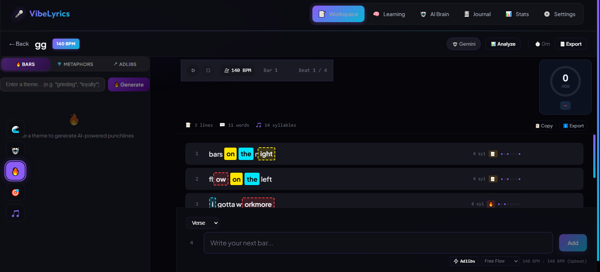
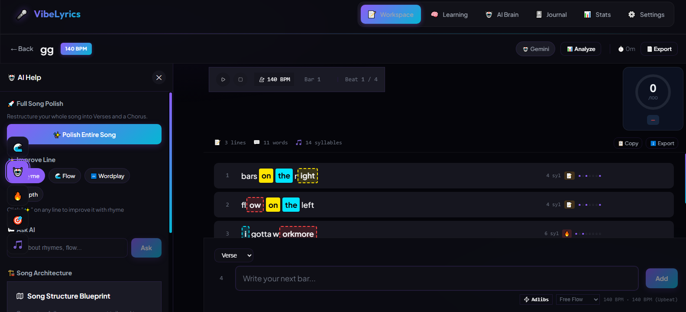
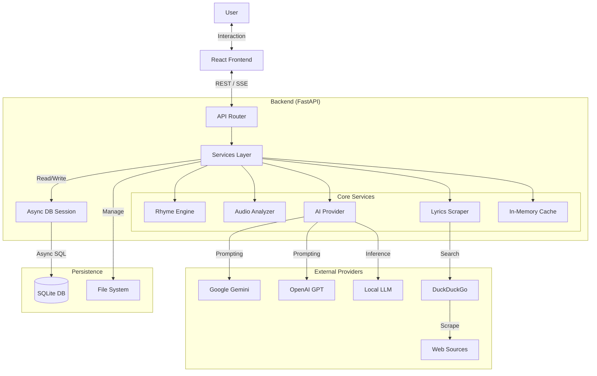

# VibeLyrics 🎤 

**VibeLyrics** is a professional-grade hip-hop lyric writing assistant and analysis suite. It combines a distraction-free writing environment with advanced algorithmic analysis, AI styling, and full production tools to help artists craft complex rhymes and flows.

---

## 🌟 Key Features

### 📖 Smart Writing Interface

- **Left-Side Split Panels**: New intuitive layout with floating toggles for **RhymeWave** (rhyme dictionary) and **AI Help**.
- **Real-Time AI Streaming**: Ghost text streams in instantly as you type (like ChatGPT).
- **Power Tools**: Undo/Redo history (`Ctrl+Z`), Keyboard Shortcuts, and Lazy Loading.
- **Offline Support**: Full functionality offline via Service Workers.
- **Smart Dictionary**: Right-click *any* word for 6-layer analysis (Rhymes, Synonyms, Slang).
- **Multi-Language Rhymes**: Native support for **English, Hindi, and Kannada** phonetic rhymes.
- **Stress Pattern Detection**: Automatic analysis of rhythm and meter (e.g., `/x/x` for trochaic).
- **Export Options**: Export to PDF (styled), TXT, or JSON backup.

### 🎨 Modern "Dreamy" Design System

- **Glassmorphism UI**: Premium frosted-glass cards, ethereal deep-space backgrounds, and aurora gradients.
- **Micro-Interactions**: Satisfying ripple effects, smooth hover lifts, and glowing focus states.
- **Fluid Animations**:
  - **Page Transitions**: Smooth fade-and-slide navigation via Framer Motion.
  - **Skeleton Loading**: Polished shimmer effects during data fetching.
  - **Staggered Lists**: Cinematic entrance animations for content.
- **Performance Optimized**: Lazy loading, code splitting, and memoized components for 60fps interaction.

## ✨ Key Features

- **👻 AI Ghostwriter ("Vibe")**: An advanced AI partner that mimics your unique style, vocabulary, and emotional tone. It learns from your **Journal** and respects your **Banned/Favorite Words**.
- **📓 Private Journal**: Capture loose thoughts and daily emotions. The AI reads this context to provide suggestions that match your current headspace.
- **🎤 Advanced Rhyme Engine**:
  - **Multi-Color Highlights**: Visualizes assonance, consonance, and internal rhymes in real-time.
  - **Scheme Detection**: Automatically identifies patterns like **ABAB**, **AABB**, and **XAXA** as you write.
- **🎛️ Deep Customization**: Set your **Favorite Words**, **Banned Words**, and **Slang Preferences** to tailor the AI's vocabulary.
- **📚 AI Learning Center**: Teach your AI ghostwriter in real-time. Scrape lyrics from the web, upload `.pdf`/`.docx` files, and explore its brain via an interactive neural network force graph. Compare your writing DNA across 6 axes with a radar chart, auto-annotate lyrics, and train the AI on your favorite beats with BPM/key extraction.
- **⚡ Real-time Analysis**: Instant feedback on syllable counts, stress patterns, and figures of speech.

### 🧠 Advanced NLP & Wordplay

- **Wordplay Engine**: Instantly generates double entendres, puns, and punchlines based on your song's theme.
  
  

- **Semantic Drift Detection**: Warns you if your verse starts wandering off-topic from your opening lines.
- **Interactive 3D Theme Network**: Visualize your recurring lyrical themes as a 3D neural network graph spanning all your sessions.
- **Beat Analysis**: Drag-and-drop audio uploads automatically extract BPM, musical key, song sections, and suggest optimal syllables-per-bar.

  

### 🧠 Robust AI Engine

- **Model Rotation**: Automatic fallback hierarchy (Gemini 2.5 → 2.0 → Flash Lite → Gemma).
- **Quota Management**: Intelligently handles rate limits without disrupting your flow.
- **Real-Time Streaming**: Instant ghost-text suggestions that adapt to your typing speed.
- **Brainstorming**: Generate creative themes and catchy song titles on demand.
- **Adlib Suggestion**: Context-aware adlib placement ideas (Hype, Flow, Reaction).

### 🎨 AI Style Transfer

Write in the signature style of legendary artists:

- **Available Styles**: Eminem, Kendrick Lamar, Drake, J. Cole, Nas, Travis Scott, Jay-Z, Kanye West.
- **Style Characteristics**: Mimics rhyme patterns, vocabulary density, and flow structures.
- **Transformation**: Rewrite your lines to match a specific artist's voice.

### 📊 Stats & Gamification

- **Writing Dashboard**: Track lines written, vocabulary growth, and daily consistency.
- **Rhyme Scheme Analysis**: See which schemes you use most (AABB, ABAB, Compound).
- **Achievements**: Unlock badges for streaks, complex multi-syllabics, and flow mastery.

### 🔍 Search & Recall

- **Full-Text Search**: Instantly find any line you've ever written, even with typos (fuzzy matching).
- **Phonetic Search**: Find lines from your history that *sound* like your current idea.
- **Reference Management**: organize and search your reference tracks and lyrics.

### ⚡ Background Processing

- **Async AI Generation**: Get suggestions without freezing your interface.
- **Audio Analysis**: Background BPM detection and waveform generation.
- **Task Queue**: Robust job processing tasks.

---

## 📐 Architecture


```mermaid
graph TD
    Client[React Frontend]
    User[User]
    
    subgraph "Backend (FastAPI)"
        API[API Router]
        Services[Services Layer]
        DB_Layer[Async DB Session]
        
        subgraph "Core Services"
            Rhyme[Rhyme Engine]
            Audio[Audio Analyzer]
            AI_Service[AI Provider]
            Scraper[Lyrics Scraper]
            Cache[In-Memory Cache]
        end
    end
    
    subgraph "External Providers"
        Gemini[Google Gemini]
        OpenAI[OpenAI GPT]
        LMStudio[Local LLM]
        Duck[DuckDuckGo]
        Web[Web Sources]
    end
    
    subgraph "Persistence"
        SQLite[(SQLite DB)]
        Files[File System]
    end

    User <-->|Interaction| Client
    Client <-->|REST / SSE| API
    
    API --> Services
    
    Services --> Rhyme
    Services --> Audio
    Services --> AI_Service
    Services --> Scraper
    Services --> Cache
    
    AI_Service -->|Prompting| Gemini
    AI_Service -->|Prompting| OpenAI
    AI_Service -->|Inference| LMStudio
    Scraper -->|Search| Duck
    Duck -->|Scrape| Web
    
    Services -->|Read/Write| DB_Layer
    DB_Layer -->|Async SQL| SQLite
    Services -->|Manage| Files
```

---

## 🛠️ Technology Stack

### 💻 Frontend (Modern Vibe)

- **Core**: React 19 + TypeScript + Vite 7
- **Styling**: Tailwind CSS 4 + clsx + tailwind-merge
- **State Management**: Zustand 5 (Atomic state)
- **Animations**: Framer Motion 12 (Page transitions, Micro-interactions)
- **Visualization**: Canvas API (Audio Visualizer), Recharts (Style Stats)
- **Virtualization**: react-window (Performance for long lists)
- **Testing**: Playwright (E2E) + Vitest (Unit)

### 🔌 Backend (Async Power)

- **Framework**: FastAPI (Python 3.11+)
- **Testing**: Pytest + Pytest-Asyncio
- **Database**: SQLAlchemy 2.0 (Async) + AIOSQLite
- **Caching**: In-memory caching (falls back to no-op)
- **Scraping**: BeautifulSoup4 + DuckDuckGo Search (No API Keys needed)
- **Audio Analysis**: Librosa + NumPy

### 🧠 AI & NLP Engine

- **LLM Providers**:
  - Google Gemini 2.0 (Primary)
  - OpenAI GPT-4o (Fallback)
  - Local LLM (LM Studio support)
- **Rhyme Engine**: CMU Dict (`pronouncing`) + Phonetic Algorithms
- **Concept Extraction**: Custom NLP pipeline using NLTK/Spacy (lightweight)

### 🏗️ DevOps & Tools

- **Linting**: ESLint + Prettier
- **Package Managers**: npm + pip

---

## 📂 Project Structure

```text
vibelyrics/
├── backend/                # FastAPI Application
│   ├── tests/              # Pytest Unit & Integration Tests
│   ├── main.py             # App Entry Point & Middleware
│   ├── config.py           # Configuration & Settings
│   ├── database.py         # Async Database Connection
│   ├── models/             # SQLAlchemy Database Models
│   ├── routers/            # API Route Handlers
│   │   ├── ai.py               # AI Generation & Rhymes
│   │   ├── scraper.py          # Lyrics Scraper Endpoint
│   │   └── stats.py            # Style Analysis & Stats
│   ├── schemas/            # Pydantic Data Schemas
│   └── services/           # Core Business Logic
│       ├── ai_provider.py      # LLM Integration
│       ├── cache.py            # Redis Caching Service
│       ├── scraper.py          # Lyrics Scraper Logic
│       └── rhyme_detector.py   # Phonetic Rhyme Engine
├── frontend/               # React Frontend (Vite)
│   ├── e2e/                # Playwright E2E Tests
│   ├── src/
│   │   ├── tests/          # Vitest Unit Tests
│   │   ├── components/     # UI Components
│   │   │   ├── session/        # Core Editor Components
│   │   │   │   ├── AudioVisualizer.tsx # Audio Reactive UI
│   │   │   │   ├── RhymeCompleter.tsx  # AI Rhyme Suggestions
│   │   │   │   └── VirtualLineRow.tsx  # Optimized List Rendering
│   │   │   └── stats/          # Analysis Components
│   │   │       └── StyleDashboard.tsx  # Radar Charts
│   │   ├── styles/         # Global Styles (Dreamy Theme)
│   └── vite.config.ts      # Vite Configuration
├── data/                   # Local Persistence
└── requirements.txt        # Python Dependencies
```

---

## 🚀 Getting Started

### Prerequisites

- **Python 3.10+** (Recommend 3.11)
- **Node.js 18+**
- **Git**

### 1. Setup

Clone the repository and enter the directory:

```bash
git clone https://github.com/yourusername/vibelyrics.git
cd vibelyrics
```

Create a virtual environment and install backend dependencies:

```bash
# Windows
python -m venv .venv
.venv\Scripts\activate

# Mac/Linux
python3 -m venv .venv
source .venv/bin/activate

# Install dependencies
pip install -r requirements.txt
```

Install frontend dependencies:

```bash
cd frontend
npm install
cd ..
```

### 23. **Configure API Keys**

   Copy the example environment file:

   ```bash
   cp .env.example .env      # Mac/Linux
   # OR
   copy .env.example .env    # Windows
   ```

   Then open `.env` and add your keys:

   ```env
   GEMINI_API_KEY=your_key_here
   OPENAI_API_KEY=your_key_here    # Optional
   ```

### 3. Running the Application

#### Option A: Unified Runner (Recommended)

The robust `run.py` script is the easiest way to start both the FastAPI backend and the React frontend in a single terminal. It handles everything automatically:
- Installs Python dependencies (`requirements.txt`)
- Installs Node dependencies (`npm install`)
- Frees port 5001 if it's currently occupied
- Stays open and monitors both processes

```bash
python3 run.py
```

*For faster restarts, skip dependency checks:*
```bash
python3 run.py --skip-install
```

- **Frontend**: <http://localhost:5173>
- **Backend**: <http://localhost:5001>

#### Option B: Manual Mode (Split Terminals)

##### Terminal 1: Backend

```bash
python -m uvicorn backend.main:app --reload --port 5001
```

##### Terminal 2: Frontend

```bash
cd frontend
npm run dev
```


---

## 🔍 API Documentation

Interactive Swagger documentation is auto-generated and available when the backend is running.

- **Swagger UI**: `http://localhost:5001/docs`
- **ReDoc**: `http://localhost:5001/redoc`

### Core Endpoints

- `GET /api/sessions`: List all sessions
- `POST /api/lines`: Add a new lyric line
- `POST /api/ai/suggest`: Get AI suggestions (Streaming)
- `POST /api/journal`: Create a journal entry
- `POST /api/settings`: Update user preferences
- `POST /api/scraper/scrape`: Scrape lyrics (No API Key)

### 🕸️ Using the Lyrics Scraper

The scraper service allows you to fetch training data from the web without needing API keys. It uses DuckDuckGo to search for the most relevant lyrics page (prioritizing AZLyrics) and scrapes the content.

**Request:** `POST /api/scraper/scrape`

```json
{
  "artist": "Kendrick Lamar",
  "title": "DNA"
}
```

**Response:**

```json
{
  "success": true,
  "data": {
    "title": "DNA",
    "artist": "Kendrick Lamar",
    "lyrics": "I got, I got, I got, I got...",
    "source": "https://www.azlyrics.com/..."
  }
}
```

---

## 🤝 Contributing

Contributions are welcome! Please run tests before submitting PRs:

### Backend Tests

```bash
pytest
```

### Frontend Tests

```bash
npm run test:unit  # Unit tests
npx playwright test # E2E tests
```

## 📄 License

Distributed under the MIT License.
